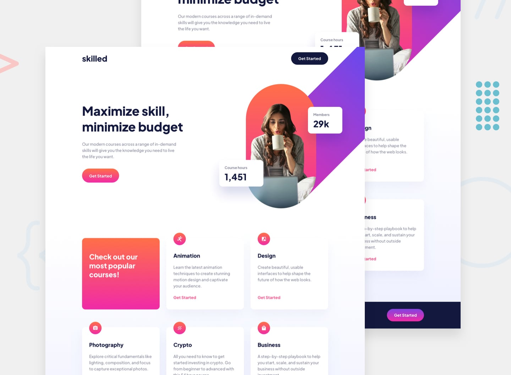

# 📌 Skilled E-Learning Landing Page

This project is a solution to the "Skilled E-learning Landing Page" challenge on Frontend Mentor.  
The challenge focuses on building a fully responsive landing page while improving layout precision, responsive behavior, and overall UI consistency.

## 🖼️ Preview



---

## 🎯 Overview

During the development of this project, the following aspects were implemented:

- Creating a responsive layout that adapts seamlessly across different screen sizes
- Applying hover states to interactive elements for improved user interaction
- Reproducing the design as closely as possible based on the provided layout

---

## 🧠 What I Learned

Through this project, I practiced:

- Strengthening responsive layout techniques
- Improving attention to spacing, alignment, and visual hierarchy
- Implementing hover interactions to enhance usability
- Translating a static design into a clean and structured layout

---

## 🛠️ Tech Stack & Concepts

- **Framework / Library:** React
- **Styling:** Tailwind CSS
- **Architecture:** Component-Based Structure
- **Markup:** Semantic HTML
- **Code Formatting:** Prettier
- **Version Control:** Git & GitHub

---

## 🔗 Links

- 💻 **Live Demo:** https://24-skilled-elearning-landing-page.vercel.app/
- 🧠 **Challenge:** https://www.frontendmentor.io/solutions/skilled-e-learning-landing-page-react-tailwindcss-components-CoyiW4cAF8

---

## ⚙️ Installation & Running the Project

To run this project locally, follow these steps:

```bash
# Clone the repository
git clone https://github.com/Ncticn/react-projects.git

# Navigate to the project directory
cd 24-skilled-elearning-landing-page

# Install dependencies
npm install

# Start the development server
npm run dev
```

---

## 👤 Author

**Ncticn**  
Front-End Developer

- GitHub: https://github.com/Ncticn
- LinkedIn: https://www.linkedin.com/in/ncticn/
- Frontend Mentor: https://www.frontendmentor.io/profile/Ncticn

---

## 📝 License

This project is licensed under the MIT License.  
© 2026 Ncticn.
