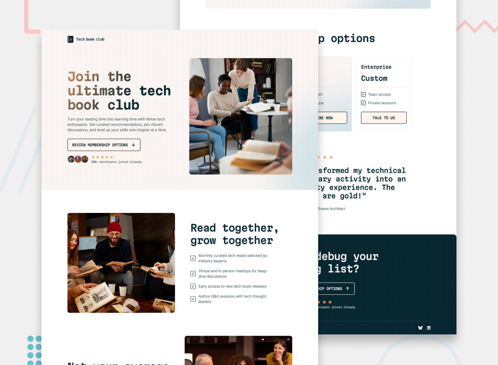

# 📌 Tech Book Club Landing Page

This project is a solution to the "Tech Book Club Landing Page" challenge on Frontend Mentor.  
The challenge focuses on building a responsive landing page using common layout patterns, with attention to interaction states and visual details.

## 🖼️ Preview



---

## 🎯 Overview

During the development of this project, the following aspects were implemented:

- Creating a responsive layout that adapts correctly across different screen sizes
- Applying hover and focus states to all interactive elements
- Organizing the project with a clean and maintainable folder structure
- Building the layout around a dedicated Layout component
- Reproducing the design as closely as possible based on the provided layout

---

## 🧠 What I Learned

Through this project, I practiced:

- Building layouts using common and reusable layout patterns
- Managing hover and focus states for better accessibility and usability
- Improving responsive design techniques
- Applying gradient text effects using background-clip
- Combining background color and background image in a single element
- Positioning decorative pattern images using absolute positioning
- Placing background patterns behind specific words in headings
- Creating rating stars in a sequential and structured way
- Using ::before and ::after pseudo-elements in card components
- Paying close attention to interaction details and visual consistency

---

## 🛠️ Tech Stack & Concepts

- **Framework / Library:** React
- **Styling:** Tailwind CSS
- **Architecture:** Component-Based Structure
- **Markup:** Semantic HTML
- **Code Formatting:** Prettier
- **Version Control:** Git & GitHub

---

## 🔗 Links

- 💻 **Live Demo:** https://29-tech-book-club-landing-page.vercel.app/
- 🧠 **Challenge:** https://www.frontendmentor.io/solutions/fylo-data-storage-component-react-tailwindcss-prettier-2UT4pP1NMx

---

## ⚙️ Installation & Running the Project

To run this project locally, follow these steps:

```bash
# Clone the repository
git clone https://github.com/Ncticn/react-projects.git

# Navigate to the project directory
cd 29-tech-book-club-landing-page

# Install dependencies
npm install

# Start the development server
npm run dev
```

---

## 👤 Author

**Ncticn**  
Front-End Developer

- GitHub: https://github.com/Ncticn
- LinkedIn: https://www.linkedin.com/in/ncticn/
- Frontend Mentor: https://www.frontendmentor.io/profile/Ncticn

---

## 📝 License

This project is licensed under the MIT License.  
© 2026 Ncticn.
