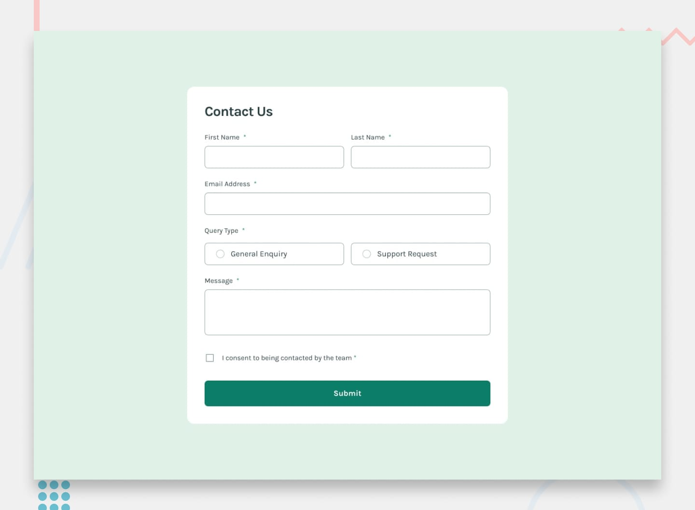

# 📌 Contact Form

This project is a solution to a contact form challenge focused on accessibility and form validation.  
The goal was to build a fully accessible and responsive contact form that closely matches the provided design while ensuring proper validation and user feedback.

## 🖼️ Preview



## 🎯 Overview

During the development of this project, the following aspects were implemented:

- Building a fully responsive contact form layout
- Implementing client-side form validation for required fields and email format
- Displaying a success toast message upon successful submission
- Ensuring the form can be completed using only keyboard navigation
- Making inputs, validation messages, and success feedback accessible to screen readers
- Applying hover and focus states to all interactive elements
- Reproducing the design as closely as possible based on the provided layout

## 🧠 What I Learned

Through this project, I practiced:

- Building accessible forms with proper semantic HTML structure
- Implementing client-side validation logic for multiple input types
- Managing success and error states within form components
- Ensuring full keyboard accessibility for form interactions
- Improving screen reader support using accessible markup techniques
- Strengthening responsive layout techniques for form-based interfaces
- Paying close attention to user feedback and accessibility standards

## 🛠️ Tech Stack & Concepts

- **Framework / Library:** React
- **Styling:** Tailwind CSS
- **Architecture:** Component-Based Structure
- **Markup:** Semantic HTML
- **Code Formatting:** Prettier
- **Version Control:** Git & GitHub

## 🔗 Links

- 💻 **Live Demo:** https://ncticn.vercel.app/projects/35-contact-form
- 🧠 **Challenge:** https://www.frontendmentor.io/solutions/contact-form-react-typescript-tailwindcss-components-PqSbrtbBPb

## ⚙️ Installation & Running the Project

To run this project locally, follow these steps:

```bash
# Clone the repository
git clone https://github.com/Ncticn/react-projects.git

# Navigate to the project directory
cd 35-contact-form

# Install dependencies
npm install

# Start the development server
npm run dev
```

## 👤 Author

**Ncticn**  
Front-End Developer

- GitHub: https://github.com/Ncticn
- LinkedIn: https://www.linkedin.com/in/ncticn/
- Frontend Mentor: https://www.frontendmentor.io/profile/Ncticn

## 📝 License

This project is licensed under the MIT License.  
© 2026 Ncticn.
