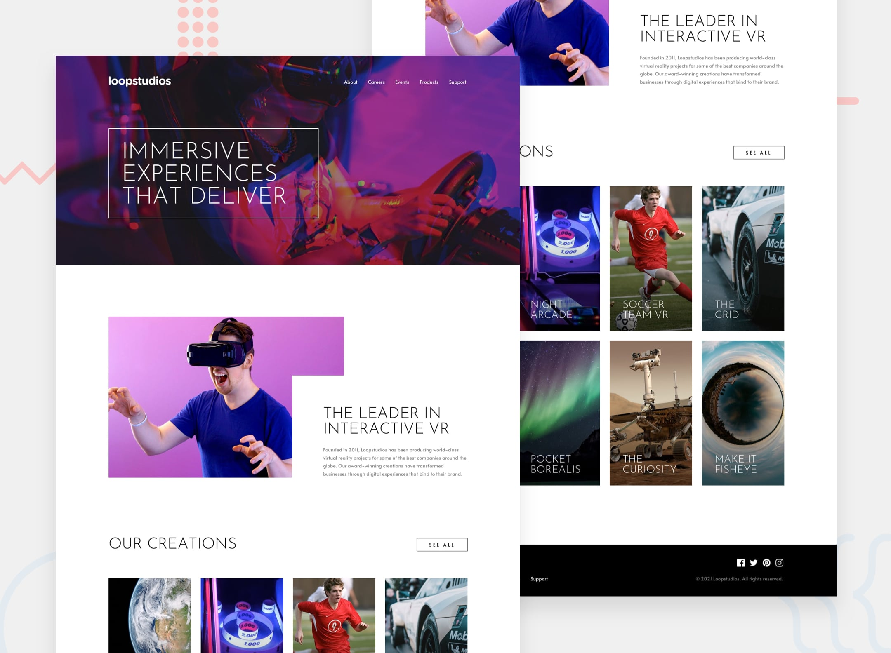

# 📌 Loopstudios Landing Page

This project is a solution to the "Loopstudios Landing Page" challenge on Frontend Mentor.
The challenge focuses on building a responsive landing page layout while practicing modern layout techniques such as CSS Grid and structured page composition.

## 🖼️ Preview



## 🎯 Overview

During the development of this project, the following aspects were implemented:

- Creating a responsive landing page that adapts to different screen sizes
- Building structured sections based on the provided design
- Practicing layout composition using CSS Grid techniques
- Implementing hover states for interactive elements
- Reproducing the design as closely as possible to the original layout
- Implementing a mobile navigation menu for smaller screen sizes

## 🧠 What I Learned

Through this project, I practiced:

- Creating responsive layouts that work across mobile, tablet, and desktop screens
- Using CSS Grid to build structured and flexible layouts
- Organizing landing page sections in a clean and maintainable structure
- Implementing hover interactions to improve user experience
- Strengthening my understanding of layout composition and visual hierarchy in landing pages

## 🛠️ Tech Stack & Concepts

- **Framework / Library:** React
- **Styling:** Tailwind CSS
- **Architecture:** Component-Based Structure
- **Markup:** Semantic HTML
- **Code Formatting:** Prettier
- **Version Control:** Git & GitHub

## 🔗 Links

- 💻 **Live Demo:** https://ncticn.vercel.app/projects/38-loopstudios-landing-page
- 🧠 **Challenge:** https://www.frontendmentor.io/solutions/typemaster-pre-launch-landing-page-react-typescript-tailwindcss-20aaj8U8An

## ⚙️ Installation & Running the Project

To run this project locally, follow these steps:

```bash
# Clone the repository
git clone https://github.com/Ncticn/react-projects.git

# Navigate to the project directory
cd 38-loopstudios-landing-page

# Install dependencies
npm install

# Start the development server
npm run dev
```

## 👤 Author

**Ncticn**  
Front-End Developer

- GitHub: https://github.com/Ncticn
- LinkedIn: https://www.linkedin.com/in/ncticn/
- Frontend Mentor: https://www.frontendmentor.io/profile/Ncticn

## 📝 License

This project is licensed under the MIT License.  
© 2026 Ncticn.
