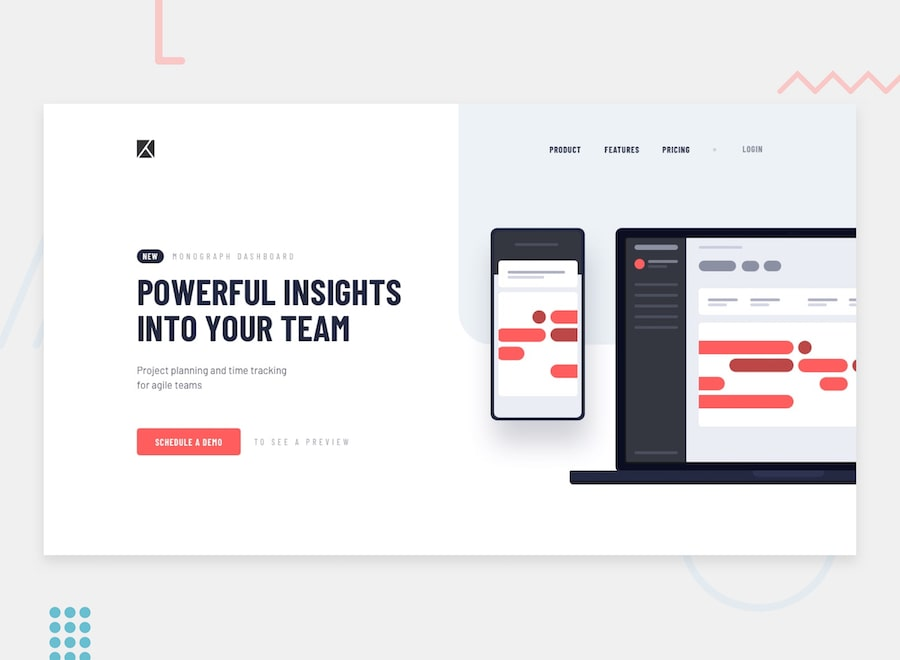

# 📌 Project Tracking Intro Component

This project is a solution to the "Project Tracking Intro Component" challenge on Frontend Mentor.
The challenge focuses on building a responsive intro component while recreating custom visual elements such as background patterns using CSS.

## 🖼️ Preview



## 🎯 Overview

During the development of this project, the following aspects were implemented:

- Creating a responsive component layout that adapts across different screen sizes
- Building the layout structure based on the provided design
- Recreating and positioning background patterns using CSS
- Implementing a mobile navigation toggle
- Applying hover and focus states to all interactive elements
- Reproducing the design as closely as possible based on the provided layout

## 🧠 What I Learned

Through this project, I practiced:

- Creating responsive component-based layouts
- Reproducing custom background patterns using CSS
- Positioning decorative elements with precision
- Implementing mobile navigation behavior
- Managing hover and focus states for better accessibility and usability
- Improving attention to detail in layout and visual consistency

## 🛠️ Tech Stack & Concepts

- **Framework / Library:** React
- **Styling:** Tailwind CSS
- **Architecture:** Component-Based Structure
- **Markup:** Semantic HTML
- **Code Formatting:** Prettier
- **Version Control:** Git & GitHub

## 🔗 Links

- 💻 **Live Demo:** https://ncticn.vercel.app/projects/39-project-tracking-intro-component
- 🧠 **Challenge:** https://www.frontendmentor.io/solutions/project-tracking-intro-component-react-tailwindcss-typescript-oJi02doqwV

## ⚙️ Installation & Running the Project

To run this project locally, follow these steps:

```bash
# Clone the repository
git clone https://github.com/Ncticn/react-projects.git

# Navigate to the project directory
cd 39-project-tracking-intro-component

# Install dependencies
npm install

# Start the development server
npm run dev
```

## 👤 Author

**Ncticn**  
Front-End Developer

- GitHub: https://github.com/Ncticn
- LinkedIn: https://www.linkedin.com/in/ncticn/
- Frontend Mentor: https://www.frontendmentor.io/profile/Ncticn

## 📝 License

This project is licensed under the MIT License.  
© 2026 Ncticn.
