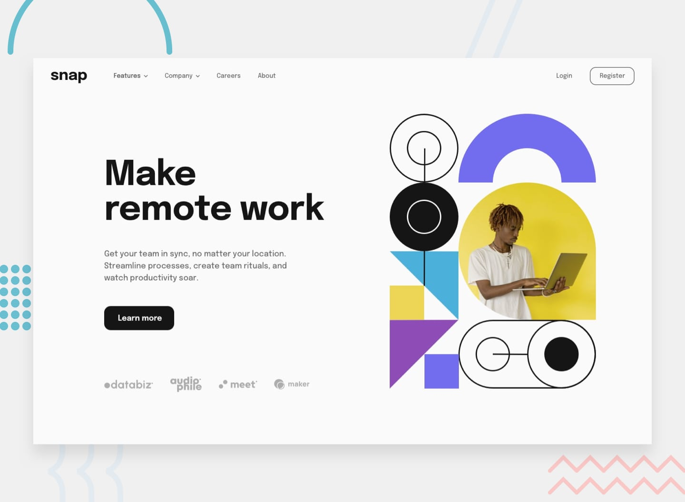

# 📌 Intro Section with Dropdown Navigation

This project is a solution to the "Intro Section with Dropdown Navigation" challenge on Frontend Mentor.
The challenge focuses on building a responsive intro section with interactive dropdown navigation menus, a common UI pattern in modern web applications.

## 🖼️ Preview



## 🎯 Overview

During the development of this project, the following aspects were implemented:

- Creating a responsive intro section layout
- Implementing dropdown navigation menus for both desktop and mobile views
- Managing navigation interactions for opening and closing dropdown menus
- Applying hover states to all interactive elements
- Ensuring the layout adapts correctly across different screen sizes
- Reproducing the design as closely as possible based on the provided layout

## 🧠 What I Learned

Through this project, I practiced:

- Building dropdown navigation menus for different screen sizes
- Managing UI state for opening and closing interactive elements
- Implementing responsive navigation patterns
- Improving layout structuring for header and intro sections
- Applying hover interactions to enhance user experience
- Strengthening responsive design techniques for navigation components

## 🛠️ Tech Stack & Concepts

- **Framework / Library:** Next / React
- **Styling:** Tailwind CSS
- **Architecture:** Component-Based Structure
- **Markup:** Semantic HTML
- **Code Formatting:** Prettier
- **Version Control:** Git & GitHub

## 🔗 Links

- 💻 **Live Demo:** https://ncticn.vercel.app/projects/42-intro-section-with-dropdown-navigation
- 🧠 **Challenge:** https://www.frontendmentor.io/solutions/age-calculator-app-react-nextjs-typescript-tailwindcss-PUbIlp2HZc

## ⚙️ Installation & Running the Project

To run this project locally, follow these steps:

```bash
# Clone the repository
git clone https://github.com/Ncticn/react-projects.git

# Navigate to the project directory
cd 42-intro-section-with-dropdown-navigation

# Install dependencies
npm install

# Start the development server
npm run dev
```

## 👤 Author

**Ncticn**  
Front-End Developer

- GitHub: https://github.com/Ncticn
- LinkedIn: https://www.linkedin.com/in/ncticn/
- Frontend Mentor: https://www.frontendmentor.io/profile/Ncticn

## 📝 License

This project is licensed under the MIT License.  
© 2026 Ncticn.
