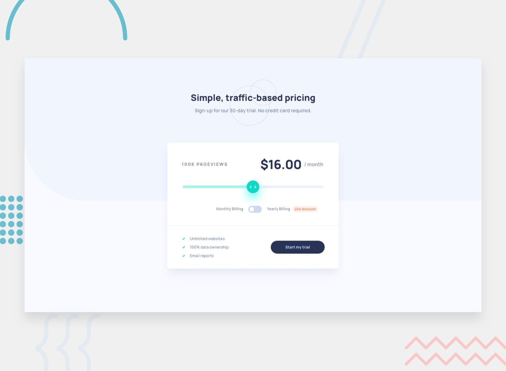

# 📌 Interactive Pricing Component

This project is a solution to the "Interactive Pricing Component" challenge on Frontend Mentor.
The challenge focuses on building an interactive pricing component using JavaScript, including a custom range slider and a pricing toggle system.

## 🖼️ Preview



## 🎯 Overview

During the development of this project, the following aspects were implemented:

- Creating a responsive pricing component layout
- Implementing a custom range input slider to control pricing values
- Adding a toggle switch to update pricing based on different billing options
- Dynamically updating price and page view values based on user interaction
- Applying hover states to all interactive elements
- Reproducing the design as closely as possible based on the provided layout

## 🧠 What I Learned

Through this project, I practiced:

- Building interactive UI components using JavaScript
- Working with range input sliders and handling their values
- Implementing toggle-based state changes for pricing logic
- Updating UI dynamically based on user interactions
- Improving responsive design for component-based layouts
- Enhancing user experience through interactive feedback

## 🛠️ Tech Stack & Concepts

- **Framework / Library:** Next / React
- **Styling:** Tailwind CSS
- **Architecture:** Component-Based Structure
- **Markup:** Semantic HTML
- **Code Formatting:** Prettier
- **Version Control:** Git & GitHub

## 🔗 Links

- 💻 **Live Demo:** https://ncticn.vercel.app/projects/44-interactive-pricing-component
- 🧠 **Challenge:** https://www.frontendmentor.io/solutions/blogr-landing-page-react-nextjs-typescript-tailwindcss-4D0V-WIfJ1

## ⚙️ Installation & Running the Project

To run this project locally, follow these steps:

```bash
# Clone the repository
git clone https://github.com/Ncticn/react-projects.git

# Navigate to the project directory
cd 44-interactive-pricing-component

# Install dependencies
npm install

# Start the development server
npm run dev
```

## 👤 Author

**Ncticn**  
Front-End Developer

- GitHub: https://github.com/Ncticn
- LinkedIn: https://www.linkedin.com/in/ncticn/
- Frontend Mentor: https://www.frontendmentor.io/profile/Ncticn

## 📝 License

This project is licensed under the MIT License.  
© 2026 Ncticn.
