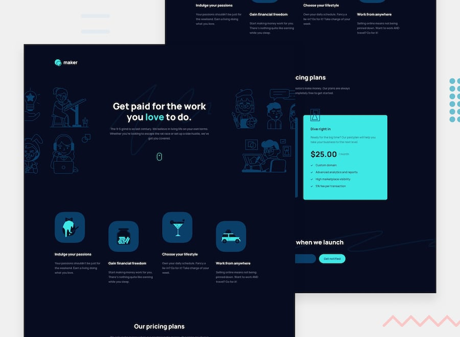

# 📌 Maker Pre Launch Landing Page

This project is a solution to the "Maker Pre-launch Landing Page" challenge on Frontend Mentor.
The challenge focuses on building a responsive landing page with a small amount of JavaScript used for custom email validation.

## 🖼️ Preview



## 🎯 Overview

During the development of this project, the following aspects were implemented:

- Creating a responsive landing page layout that adapts across different screen sizes
- Building structured sections based on the provided design
- Implementing custom email validation logic for the form input
- Displaying specific error messages for empty and invalid email inputs
- Applying hover states to all interactive elements
- Reproducing the design as closely as possible based on the provided layout

## 🧠 What I Learned

Through this project, I practiced:

- Building responsive layouts using HTML and CSS
- Implementing custom form validation using JavaScript
- Handling user input and displaying validation feedback
- Managing error states for form interactions
- Improving layout structuring for landing page designs
- Enhancing user experience through validation and interaction states

## 🛠️ Tech Stack & Concepts

- **Framework / Library:** Next / React
- **Styling:** Tailwind CSS
- **Architecture:** Component-Based Structure
- **Markup:** Semantic HTML
- **Code Formatting:** Prettier
- **Version Control:** Git & GitHub

## 🔗 Links

- 💻 **Live Demo:** https://ncticn.vercel.app/projects/45-maker-pre-launch-landing-page
- 🧠 **Challenge:** https://www.frontendmentor.io/solutions/maker-pre-launch-landing-page-nextjs-typescript-tailwindcss-YHhvVUHs5U

## ⚙️ Installation & Running the Project

To run this project locally, follow these steps:

```bash
# Clone the repository
git clone https://github.com/Ncticn/react-projects.git

# Navigate to the project directory
cd 45-maker-pre-launch-landing-page

# Install dependencies
npm install

# Start the development server
npm run dev
```

## 👤 Author

**Ncticn**  
Front-End Developer

- GitHub: https://github.com/Ncticn
- LinkedIn: https://www.linkedin.com/in/ncticn/
- Frontend Mentor: https://www.frontendmentor.io/profile/Ncticn

## 📝 License

This project is licensed under the MIT License.  
© 2026 Ncticn.
