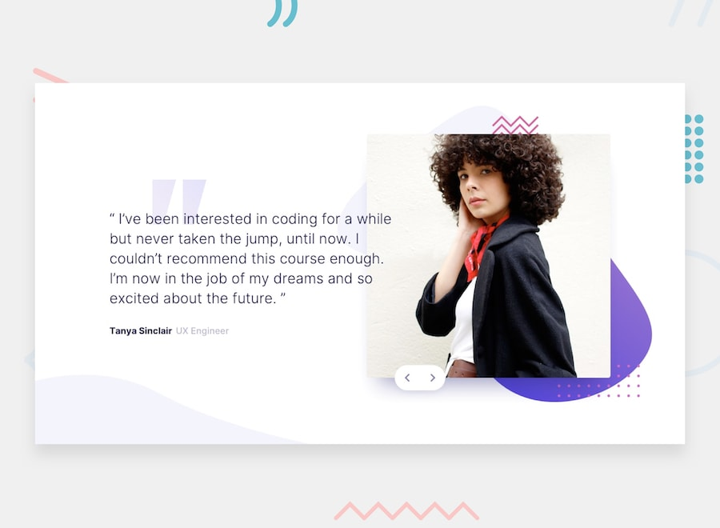

# 📌 Coding Bootcamp Testimonials Slider

This project is a solution to the "Coding Bootcamp Testimonials Slider" challenge on Frontend Mentor.
The challenge focuses on building an interactive testimonials slider using JavaScript, with attention to animations, transitions, and responsive layout.

## 🖼️ Preview



## 🎯 Overview

During the development of this project, the following aspects were implemented:

- Creating a responsive landing page layout
- Implementing a slider component to switch between testimonials
- Enabling navigation via mouse/trackpad and keyboard interactions
- Handling slide transitions and content updates dynamically
- Applying hover and focus states to all interactive elements
- Reproducing the design as closely as possible based on the provided layout

## 🧠 What I Learned

Through this project, I practiced:

- Building interactive slider components using JavaScript
- Managing state changes for switching between slides
- Implementing keyboard accessibility for navigation
- Working with animations and transitions for smoother UI experience
- Improving responsive design for interactive components
- Enhancing user experience through interaction and visual feedback

## 🛠️ Tech Stack & Concepts

- **Framework / Library:** Next / React
- **Styling:** Tailwind CSS
- **Architecture:** Component-Based Structure
- **Markup:** Semantic HTML
- **Code Formatting:** Prettier
- **Version Control:** Git & GitHub

## 🔗 Links

- 💻 **Live Demo:** https://ncticn.vercel.app/projects/46-coding-bootcamp-testimonials-slider
- 🧠 **Challenge:** https://www.frontendmentor.io/solutions/maker-pre-launch-landing-page-nextjs-typescript-tailwindcss-YHhvVUHs5U

## ⚙️ Installation & Running the Project

To run this project locally, follow these steps:

```bash
# Clone the repository
git clone https://github.com/Ncticn/react-projects.git

# Navigate to the project directory
cd 46-coding-bootcamp-testimonials-slider

# Install dependencies
npm install

# Start the development server
npm run dev
```

## 👤 Author

**Ncticn**  
Front-End Developer

- GitHub: https://github.com/Ncticn
- LinkedIn: https://www.linkedin.com/in/ncticn/
- Frontend Mentor: https://www.frontendmentor.io/profile/Ncticn

## 📝 License

This project is licensed under the MIT License.  
© 2026 Ncticn.