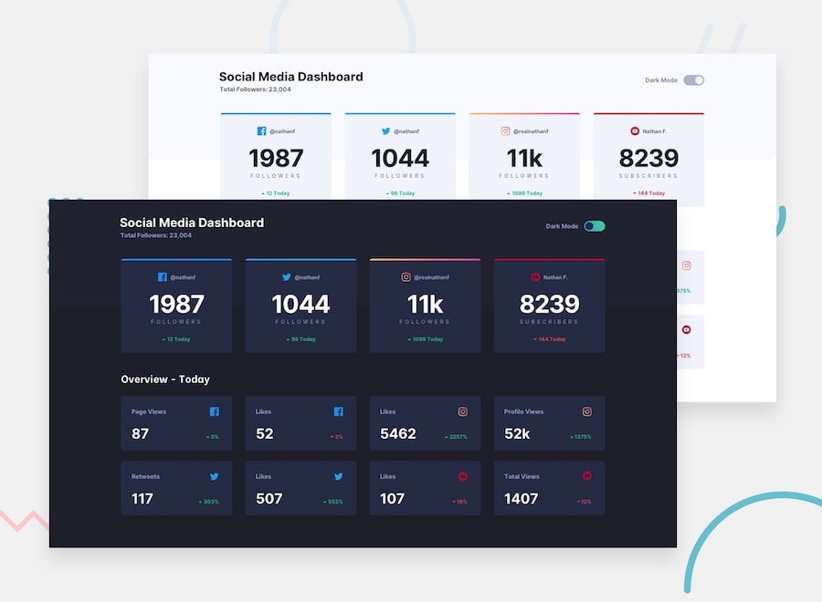

# 📌 Social Media Dashboard with Theme Switcher

This project is a solution to the "Social Media Dashboard with Theme Switcher" challenge on Frontend Mentor.
The challenge focuses on building a responsive dashboard layout using CSS Grid, along with implementing a color theme switcher using JavaScript.

## 🖼️ Preview



## 🎯 Overview

During the development of this project, the following aspects were implemented:

- Creating a responsive dashboard layout using CSS Grid
- Structuring content sections to match the provided design
- Implementing a color theme toggle for switching between themes
- Managing UI updates based on the selected theme
- Applying hover and focus states to all interactive elements
- Reproducing the design as closely as possible based on the provided layout

## 🧠 What I Learned

Through this project, I practiced:

- Building responsive layouts using CSS Grid
- Implementing a theme switcher using JavaScript
- Managing UI state changes for theme toggling
- Improving visual consistency across different themes
- Enhancing accessibility with hover and focus states
- Strengthening layout structure and dashboard design skills

## 🛠️ Tech Stack & Concepts

- **Framework / Library:** Next / React
- **Styling:** Tailwind CSS
- **Animation:** Motion (Framer Motion)
- **Architecture:** Component-Based Structure
- **Markup:** Semantic HTML
- **Code Formatting:** Prettier
- **Version Control:** Git & GitHub

## 🔗 Links

- 💻 **Live Demo:** https://ncticn.vercel.app/projects/47-social-media-dashboard-with-theme-switcher
- 🧠 **Challenge:** https://www.frontendmentor.io/solutions/social-media-dashboard-nextjs-tailwindcss-typescript-motion-ixANQFKPw_

## ⚙️ Installation & Running the Project

To run this project locally, follow these steps:

```bash
# Clone the repository
git clone https://github.com/Ncticn/react-projects.git

# Navigate to the project directory
cd 47-social-media-dashboard-with-theme-switcher

# Install dependencies
npm install

# Start the development server
npm run dev
```

## 👤 Author

**Ncticn**  
Front-End Developer

- GitHub: https://github.com/Ncticn
- LinkedIn: https://www.linkedin.com/in/ncticn/
- Frontend Mentor: https://www.frontendmentor.io/profile/Ncticn

## 📝 License

This project is licensed under the MIT License.  
© 2026 Ncticn.