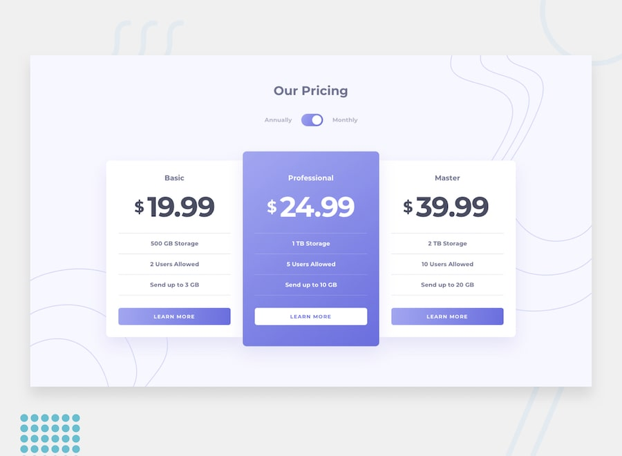

# 📌 Pricing Component with Toggle

This project is a solution to the "Pricing Component with Toggle" challenge on Frontend Mentor.
The challenge focuses on building a responsive pricing component while implementing an accessible custom toggle control.

## 🖼️ Preview



## 🎯 Overview

During the development of this project, the following aspects were implemented:

- Creating a responsive pricing component layout
- Implementing a custom toggle control for switching pricing options
- Ensuring the toggle is accessible via mouse, trackpad, and keyboard
- Managing UI updates based on the selected pricing option
- Applying hover and focus states to all interactive elements
- Reproducing the design as closely as possible based on the provided layout

## 🧠 What I Learned

Through this project, I practiced:

- Building accessible interactive components
- Implementing custom toggle controls with proper accessibility support
- Managing UI state changes based on user interaction
- Improving responsive design for component-based layouts
- Enhancing usability with keyboard navigation and focus states
- Strengthening layout structure and pricing UI patterns

## 🛠️ Tech Stack & Concepts

- **Framework / Library:** Next / React
- **Styling:** Tailwind CSS
- **Animation:** Motion (Framer Motion)
- **Architecture:** Component-Based Structure
- **Markup:** Semantic HTML
- **Code Formatting:** Prettier
- **Version Control:** Git & GitHub

## 🔗 Links

- 💻 **Live Demo:** https://ncticn.vercel.app/projects/48-pricing-component-with-toggle
- 🧠 **Challenge:** https://www.frontendmentor.io/solutions/pricing-component-with-toggle-nextjs-typescript-tailwindcss-BiEZcyoZum

## ⚙️ Installation & Running the Project

To run this project locally, follow these steps:

```bash
# Clone the repository
git clone https://github.com/Ncticn/react-projects.git

# Navigate to the project directory
cd 48-pricing-component-with-toggle

# Install dependencies
npm install

# Start the development server
npm run dev
```

## 👤 Author

**Ncticn**  
Front-End Developer

- GitHub: https://github.com/Ncticn
- LinkedIn: https://www.linkedin.com/in/ncticn/
- Frontend Mentor: https://www.frontendmentor.io/profile/Ncticn

## 📝 License

This project is licensed under the MIT License.  
© 2026 Ncticn.