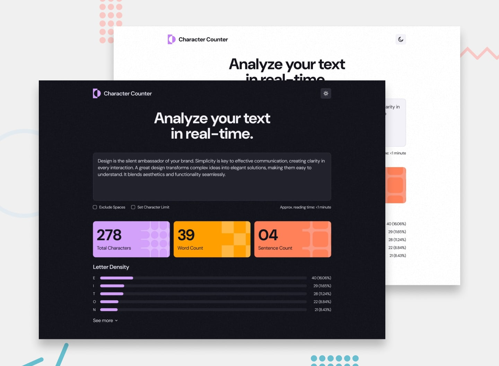

# 📌 Character Counter

This project is a solution to the "Character Counter" challenge on Frontend Mentor.
The challenge focuses on building an interactive text analysis tool using JavaScript, including real-time counters, validation, and a dynamic letter density visualization.

## 🖼️ Preview



## 🎯 Overview

During the development of this project, the following aspects were implemented:

- Creating a responsive text analysis interface
- Calculating character, word, and sentence counts dynamically
- Allowing users to include or exclude spaces in character count
- Implementing a configurable character limit with warning messages
- Displaying approximate reading time based on text input
- Generating a letter density analysis for the entered text
- Adding a color theme switcher for user preference
- Ensuring full keyboard accessibility for all interactions
- Applying hover and focus states to all interactive elements
- Reproducing the design as closely as possible based on the provided layout

## 🧠 What I Learned

Through this project, I practiced:

- Building complex interactive applications using JavaScript
- Implementing real-time text analysis and data processing
- Managing multiple UI states and user preferences
- Creating dynamic data visualizations (letter density)
- Handling user input with validation and conditional logic
- Implementing theme switching functionality
- Ensuring full keyboard accessibility for better usability
- Improving responsive design for feature-rich interfaces

## 🛠️ Tech Stack & Concepts

- **Framework / Library:** Next / React
- **Styling:** Tailwind CSS
- **Architecture:** Component-Based Structure
- **Markup:** Semantic HTML
- **Code Formatting:** Prettier
- **Version Control:** Git & GitHub

## 🔗 Links

- 💻 **Live Demo:** https://ncticn.vercel.app/projects/49-character-counter
- 🧠 **Challenge:** https://www.frontendmentor.io/solutions/character-counter-react-nextjs-typescript-tailwindcss-RvoR6pUPh9

## ⚙️ Installation & Running the Project

To run this project locally, follow these steps:

```bash
# Clone the repository
git clone https://github.com/Ncticn/react-projects.git

# Navigate to the project directory
cd 49-character-counter

# Install dependencies
npm install

# Start the development server
npm run dev
```

## 👤 Author

**Ncticn**  
Front-End Developer

- GitHub: https://github.com/Ncticn
- LinkedIn: https://www.linkedin.com/in/ncticn/
- Frontend Mentor: https://www.frontendmentor.io/profile/Ncticn

## 📝 License

This project is licensed under the MIT License.  
© 2026 Ncticn.