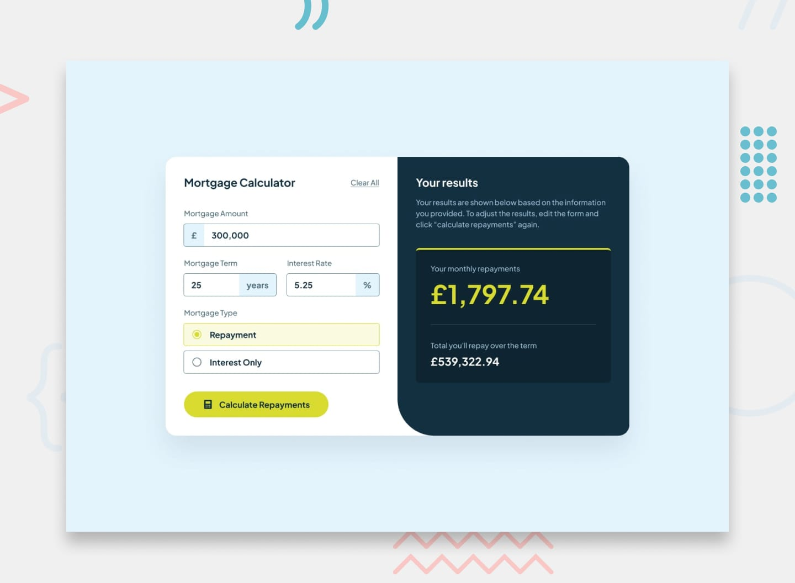

# 📌 Mortgage Repayment Calculator

This project is a solution to the "Mortgage Repayment Calculator" challenge on Frontend Mentor.
The challenge focuses on building an interactive and accessible form-based application that calculates monthly and total mortgage repayments using client-side logic.

## 🖼️ Preview



## 🎯 Overview

During the development of this project, the following aspects were implemented:

- Creating a responsive mortgage calculator interface
- Handling user input to calculate monthly and total repayment amounts
- Implementing client-side validation for required form fields
- Displaying validation messages for incomplete or incorrect inputs
- Ensuring the form can be completed using only keyboard navigation
- Updating the UI dynamically based on submitted data
- Applying hover and focus states to all interactive elements
- Reproducing the design as closely as possible based on the provided layout

## 🧠 What I Learned

Through this project, I practiced:

- Building form-based applications using JavaScript
- Implementing client-side validation and error handling
- Performing financial calculations based on user input
- Updating the DOM dynamically based on form submission
- Improving accessibility with keyboard navigation support
- Enhancing user experience through validation feedback and interaction states
- Strengthening responsive design for interactive interfaces

## 🛠️ Tech Stack & Concepts

- **Framework / Library:** Next / React
- **Styling:** Tailwind CSS
- **Architecture:** Component-Based Structure
- **Markup:** Semantic HTML
- **Code Formatting:** Prettier
- **Version Control:** Git & GitHub

## 🔗 Links

- 💻 **Live Demo:** https://ncticn.vercel.app/projects/50-mortgage-repayment-calculator
- 🧠 **Challenge:** https://www.frontendmentor.io/solutions/character-counter-react-nextjs-typescript-tailwindcss-RvoR6pUPh9

## ⚙️ Installation & Running the Project

To run this project locally, follow these steps:

```bash
# Clone the repository
git clone https://github.com/Ncticn/react-projects.git

# Navigate to the project directory
cd 50-mortgage-repayment-calculator

# Install dependencies
npm install

# Start the development server
npm run dev
```

## 👤 Author

**Ncticn**  
Front-End Developer

- GitHub: https://github.com/Ncticn
- LinkedIn: https://www.linkedin.com/in/ncticn/
- Frontend Mentor: https://www.frontendmentor.io/profile/Ncticn

## 📝 License

This project is licensed under the MIT License.  
© 2026 Ncticn.
