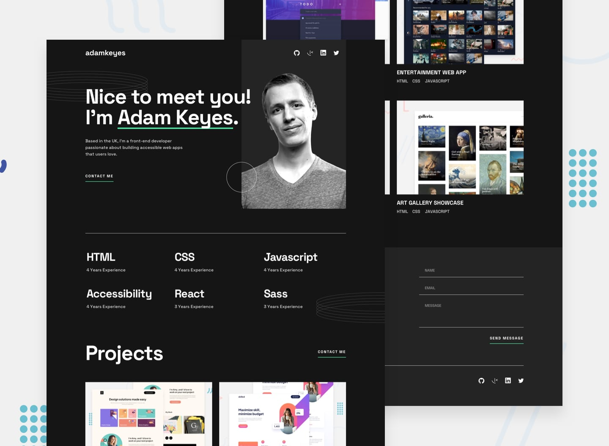

# 📌 Single Page Developer Portfolio

This project is a solution to the "Single-Page Developer Portfolio" challenge on Frontend Mentor.
The challenge focuses on building a responsive developer portfolio page with form validation and interactive UI elements.

## 🖼️ Preview



## 🎯 Overview

During the development of this project, the following aspects were implemented:

- Creating a responsive single-page portfolio layout
- Structuring portfolio sections based on the provided design
- Implementing form validation for empty fields and invalid email formats
- Displaying validation feedback for incorrect form submissions
- Applying hover and focus states to all interactive elements
- Ensuring the layout adapts correctly across different screen sizes
- Reproducing the design as closely as possible based on the provided layout

## 🧠 What I Learned

Through this project, I practiced:

- Building responsive portfolio layouts using modern CSS techniques
- Structuring multi-section pages in a clean and maintainable way
- Implementing form validation and user feedback handling
- Managing interactive states for form components
- Improving accessibility with hover and focus interactions
- Strengthening responsive design and visual hierarchy skills

## 🛠️ Tech Stack & Concepts

- **Framework / Library:** Next / React
- **Styling:** Tailwind CSS
- **Architecture:** Component-Based Structure
- **Markup:** Semantic HTML
- **Code Formatting:** Prettier
- **Version Control:** Git & GitHub

## 🔗 Links

- 💻 **Live Demo:** https://ncticn.vercel.app/projects/52-single-page-developer-portfolio
- 🧠 **Challenge:** https://www.frontendmentor.io/solutions/single-page-developer-portfolio-nextjs-typescript-tailwindcss-RsqTc8jPxW

## ⚙️ Installation & Running the Project

To run this project locally, follow these steps:

```bash
# Clone the repository
git clone https://github.com/Ncticn/react-projects.git

# Navigate to the project directory
cd 52-single-page-developer-portfolio

# Install dependencies
npm install

# Start the development server
npm run dev
```

## 👤 Author

**Ncticn**  
Front-End Developer

- GitHub: https://github.com/Ncticn
- LinkedIn: https://www.linkedin.com/in/ncticn/
- Frontend Mentor: https://www.frontendmentor.io/profile/Ncticn

## 📝 License

This project is licensed under the MIT License.  
© 2026 Ncticn.